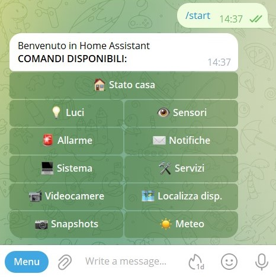
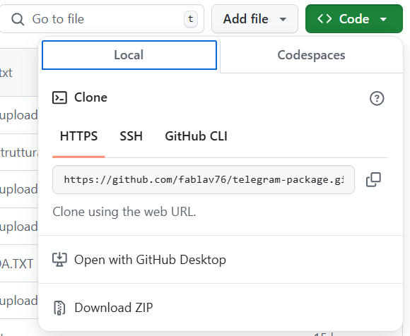

## Un package per inviare messaggi Telegram 
Questo package consente di controllare casa attraverso Telegram eseguendo semplicemente un comando /start 
e poi utilizzando i bottoni per controllare luci, allarme, notifiche, e molto altro.  
<b>Se ti piace questo packages lascia una 🌟 su Github!</b>

 
Video Youtube ▶️

 

| DOCUMENTAZIONE | NOTE |
| :---: | --- |
| [Avvertenze](Istruzioni/Avvertenze.txt) | **Leggere le avvertenze prima di installare questo package** |
| [Pre-requisiti](Istruzioni/1_pre_requisiti.txt) | **Prima di iniziare leggere quali sono i pre requisiti** |
| [Come creare un Bot](Istruzioni/2_come_creare_un_bot.txt) | Istruzioni sulla creazione di un bot Telegram |
| [Come si fa da Home Assistant?](Istruzioni/3_come_funziona_telegram.txt) | Le principali azioni di Home Assistant per inviare, modificare, cancellare un messaggio |
| [Comandi e Callback - Interazioni nella chat](Istruzioni/4_comandi_e_callback.txt) | Come comunicano Telegram ed Home Assistant? |
| [Struttura del Package](Istruzioni/5_struttura_package.txt) | Come funziona il package e schema logico |
| [Le automazioni](Istruzioni/6_automazioni.txt) | Elenco delle automazioni, quello che fanno e come si concatenano agli script |
| [Gli script](Istruzioni/7_script.txt) | Elenco degli script e loro funzionamento |

 
 

## Download ZIP

[Github](https://github.com/fablav76/telegram-package/tree/main/packages/Telegram_package) permette di effettuare il completo download dei file che costituiscono il pacchetto. 
Basta cliccare sul pulsante "verde" e si scaricherà un file zip con tutti i packages presenti.

 
<table align="center">
	<tr>
	    <th>
🎫 Github Download 🎫
</th>
	</tr>
  <tr>
      <td>

</td>
      
  </tr>
</table>
